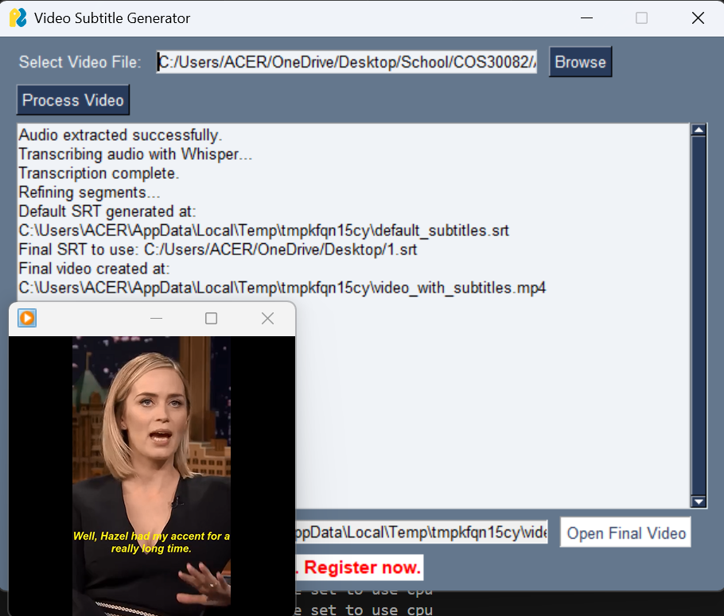
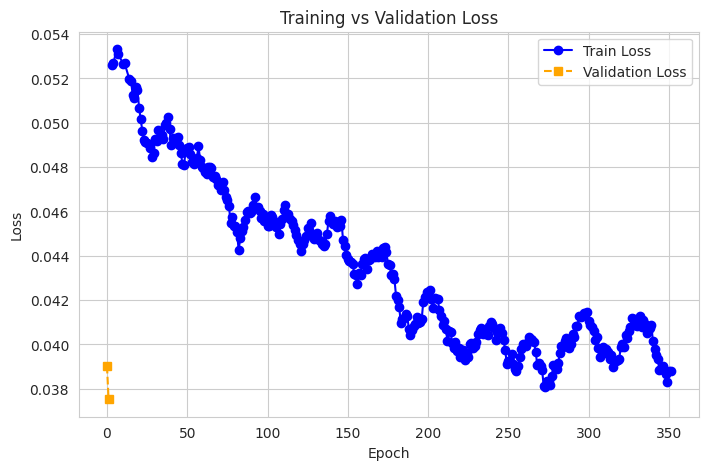
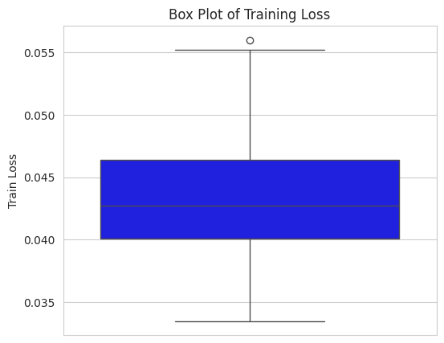
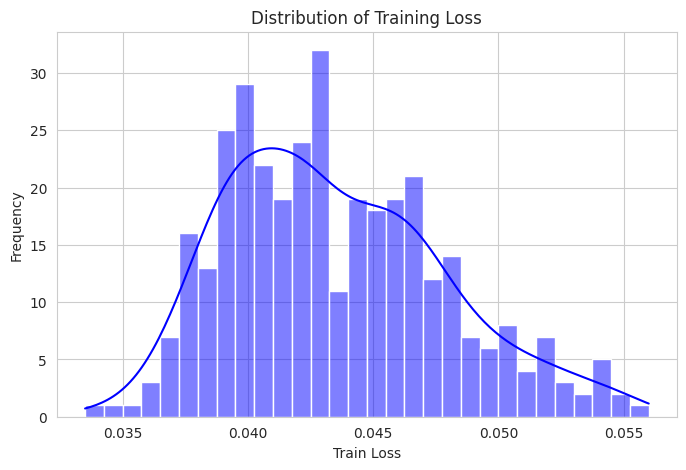

# Whisper Video Captioning

### Automated Speech-to-Text Captioning for Videos and Noise Robustness Analysis Using OpenAI Whisper

**Published by Springer at CITA 2025 (Conference on Information Technology and its Applications)**
**DOI: [10.1007/978-3-032-00972-2_31](https://doi.org/10.1007/978-3-032-00972-2_31)**

---

## Overview

This study evaluates OpenAI Whisper for automated video captioning, analyzing its performance across clean speech, accented speech, and noisy environments. A post-processing pipeline including phonetic normalization, punctuation restoration, and spelling correction significantly improves transcription accuracy and produces subtitle-ready output in SRT format.

---

## Key Results

| Metric | Before Post-Processing | After Post-Processing |
|---|---|---|
| **Word Error Rate (WER)** | 18.08% | **4.75%** |
| **Character Error Rate (CER)** | 6.04% | **2.06%** |
| **Sentence Error Rate (SER)** | 5.07% | **1.60%** |
| **BLEU Score** | 0.83 | **0.91** |

### Accent Robustness

| Accent | WER |
|---|---|
| United States English | 0.00% |
| British English | 0.00% |
| South Asian English | 0.00% |
| Scottish English | 18.18% → **9.09%** (after phonetic normalization) |

---

## System Architecture

The pipeline consists of four stages:

1. **Dataset Preprocessing** — Audio filtering (3–15 seconds), resampling to 16kHz mono, loudness normalization, balanced subset selection (19,749 samples across 4 English dialects)
2. **Whisper Transcription** — Whisper-Small with beam search decoding, batch processing (16 files/batch)
3. **Post-Processing** — Punctuation restoration (transformer-based), spelling correction (LanguageTool API), phonetic normalization for Scottish English
4. **Output Formatting** — SRT subtitle files with timestamps, plain text transcripts

---

## Datasets

- **LibriSpeech Clean-100** — 100 hours of clean audiobook speech (benchmark baseline)
- **CommonVoice (Mozilla)** — Diverse English accents including British, American, Indian, and Scottish
- **UrbanSound8K** — Environmental noise for robustness testing

---

## Screenshots

### Working Application Demo


### Training Analysis




---

## Repository Contents

```
whisper-video-captioning/
├── paper/
│   └── whisper_video_captioning_CITA2025.pdf   # Published Springer paper
├── screenshots/
│   ├── app_demo.png                             # Working subtitle generator demo
│   ├── training_loss.png                        # Training vs validation loss
│   ├── training_loss_boxplot.png                # Box plot of training loss
│   └── training_loss_distribution.png           # Distribution of training loss
└── README.md
```

---

## Citation

If you use this work, please cite:

```bibtex
@inproceedings{nguyen2025whisper,
  title     = {Automated Speech-to-Text Captioning for Videos and Noise Robustness
               Analysis Using OpenAI Whisper: A Performance and Enhancement Study},
  author    = {Nguyen, Ngoc Thanh Thanh and Tran, Manh Son and Mai, Duc-Tho},
  booktitle = {Proceedings of the Conference on Information Technology
               and its Applications (CITA 2025)},
  publisher = {Springer},
  year      = {2025},
  doi       = {10.1007/978-3-032-00972-2_31}
}
```

---

## Author

**Nguyen Ngoc Thanh Thanh (Tammy)**
Lead Researcher & First Author — responsible for all experimental design, model training, testing, and evaluation.

[LinkedIn](https://linkedin.com/in/ngoc-thanh-thanh-nguyen-68004740b) · [Email](mailto:tammynguyen0699@gmail.com) · [GitHub](https://github.com/tammynguyen6)
